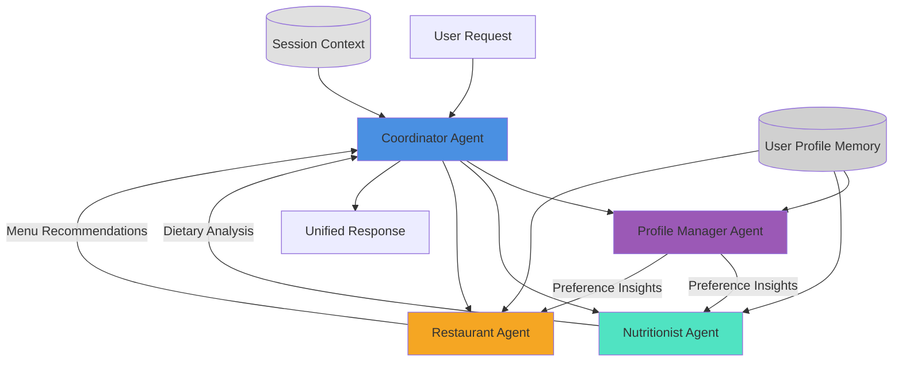
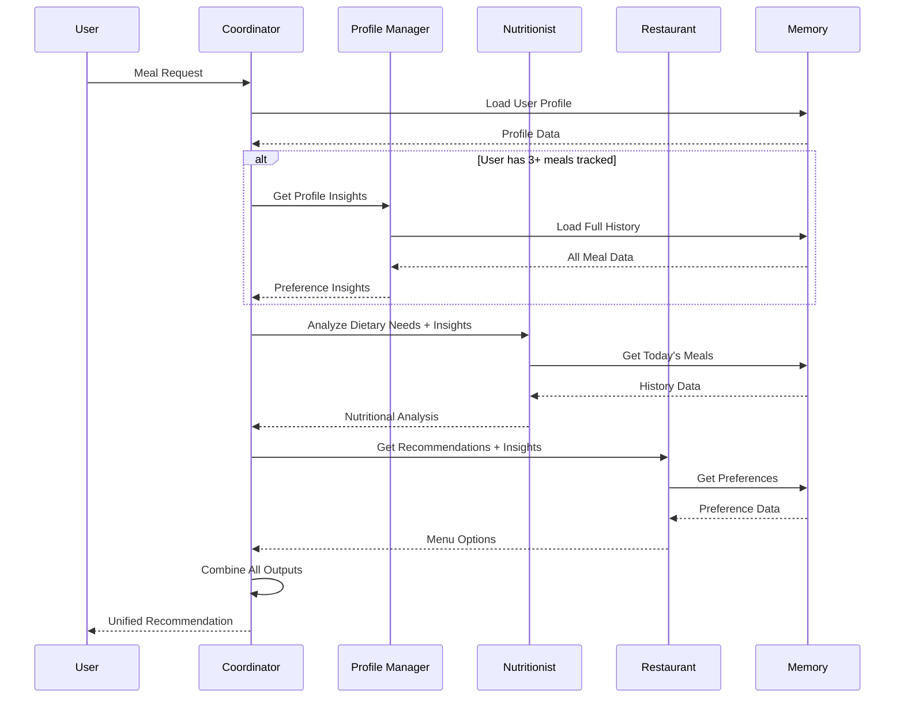

# Multi-Agent System Architecture

## Overview
Sequential pipeline pattern with 4 specialized agents coordinated by a central orchestrator.

## System Architecture



## Agent Roles

| Agent | Responsibility | Key Functions |
|-------|---------------|---------------|
| **Coordinator** | Orchestrates workflow, combines outputs | Route requests, handle errors, unify responses |
| **Nutritionist** | Analyzes dietary needs | Calculate macros, evaluate health impact, review history |
| **Restaurant** | Menu expertise | Recommend items, suggest customizations, optimize nutrition |
| **Profile Manager** | Learns user preferences | Analyze ratings, detect patterns, suggest updates, provide insights |

## Sequential Pipeline Flow



## Shared Memory Mechanisms

### 1. User Profile Memory
- **Storage**: JSON files in `data/profiles/`
- **Contents**: Preferences, meal history, statistics
- **Access**: Read by all agents, updated by Profile Manager
- **Persistence**: Disk-based, survives sessions

### 2. Session Context
- **Storage**: In-memory dictionary
- **Contents**: Agent workflow, errors, current state
- **Access**: Passed through coordinator
- **Persistence**: Request-scoped only

## File Structure

```
fastfood-nutrition-agent/
├── multi_agents/
│   ├── coordinator.py          # Main orchestrator
│   ├── nutritionist_agent.py   # Dietary analysis
│   ├── restaurant_agent.py     # Menu recommendations
│   └── profile_manager_agent.py # Preference learning
├── prompts/
│   ├── coordinator_prompt.txt
│   ├── nutritionist_agent_prompt.txt
│   ├── restaurant_agent_prompt.txt
│   └── profile_manager_prompt.txt
├── memory/
│   └── user_profile.py         # Shared memory layer
├── multi_agent_app.py          # Streamlit interface
├── demo.py                     # Demonstration script
└── profile_insights.py         # CLI insights tool
```

## Technology Stack

- **Framework**: OpenAI Agents SDK
- **LLM**: GPT-4 (via OpenAI API)
- **UI**: Streamlit
- **Storage**: JSON file-based
- **Language**: Python 3.13

