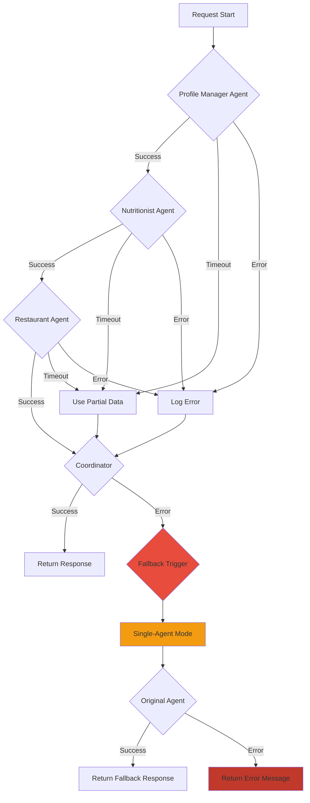
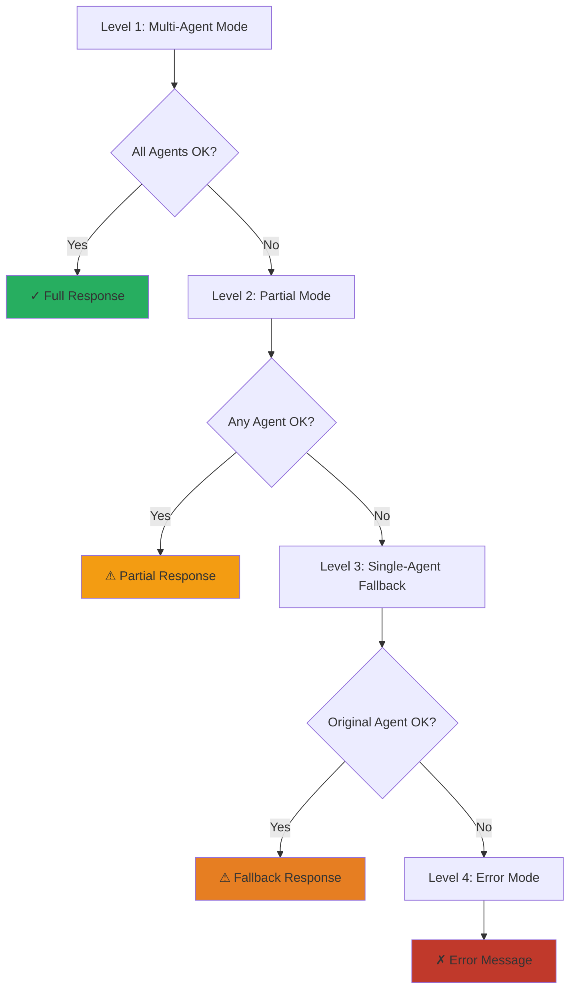
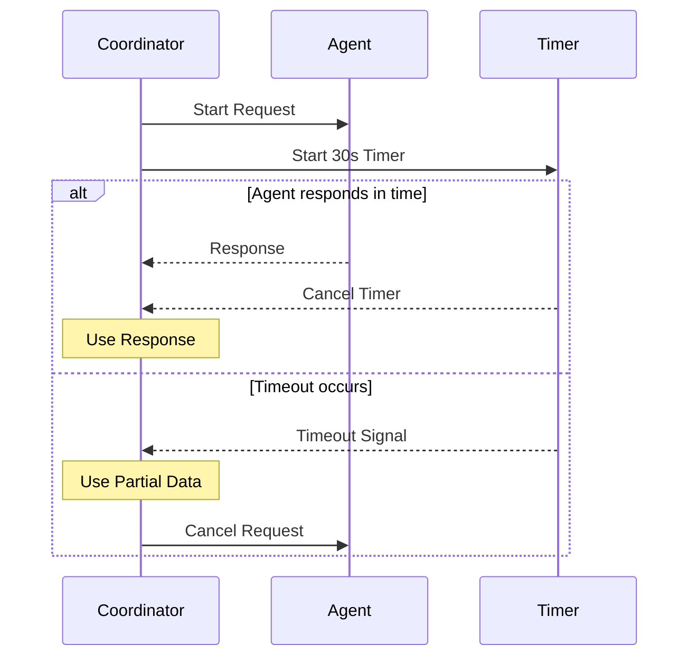
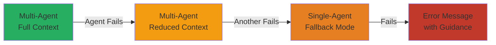
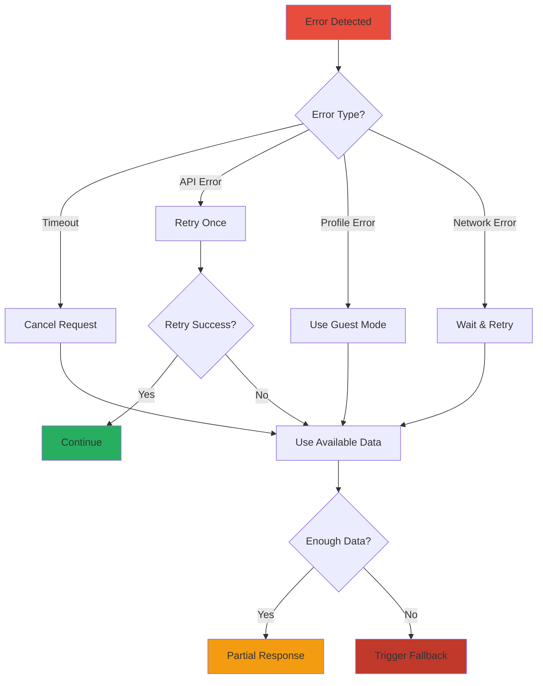

# Error Handling & Fallback Strategies

## Error Handling Architecture



## Fallback Hierarchy



## Timeout Protection

Each agent has a 30-second timeout:



## Error Types & Handling

| Error Type | Strategy | User Impact |
|------------|----------|-------------|
| **Agent Timeout** | Use partial results or skip agent | Degraded recommendations |
| **API Error** | Retry once, then fallback | Slight delay |
| **Profile Load Error** | Continue in guest mode | No personalization |
| **Prompt File Missing** | Use hardcoded defaults | Reduced quality |
| **Network Error** | Fallback to single-agent | Simplified response |
| **All Agents Fail** | Return error message | Clear error state |

## Graceful Degradation



## Session Context Tracking

The coordinator tracks errors in session context:

```python
session_context = {
    "user_goal": "...",
    "agents_used": ["Nutritionist", "Restaurant", "Coordinator"],
    "errors": [],  # Empty if all succeeded
    "fallback_triggered": False
}
```

Example with errors:

```python
session_context = {
    "user_goal": "...",
    "agents_used": ["Nutritionist"],  # Only 1 succeeded
    "errors": ["Restaurant Agent timeout"],
    "fallback_triggered": True
}
```

## Recovery Strategies



## User Communication

Errors are communicated transparently:

- **Success**: "🤝 Agents collaborated: Nutritionist → Restaurant → Coordinator"
- **Partial**: "⚠️ Restaurant Agent timeout - using nutritional guidance only"
- **Fallback**: "⚠️ Using simplified single-agent mode due to technical issues"
- **Error**: "❌ An error occurred while processing your request"

