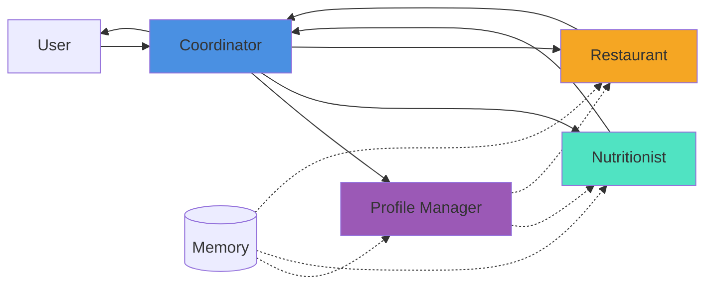

# Week 3: Multi-Agent System

## Quick Start

### Run Demo
```bash
python demo.py
```

### Launch Multi-Agent App
```bash
streamlit run multi_agent_app.py
```

## System Overview

**Pattern**: Sequential Pipeline  
**Agents**: 4 specialized (Nutritionist, Restaurant, Profile Manager, Coordinator)  
**Memory**: User profiles + Session context  
**Fallback**: Automatic single-agent mode on errors

## Architecture Diagrams



## Key Features

✅ **4 Specialized Agents**
- Nutritionist: Dietary analysis
- Restaurant: Menu expertise
- Profile Manager: Preference learning & insights
- Coordinator: Workflow orchestration

✅ **Shared Memory**
- User profiles (persistent)
- Session context (temporary)

✅ **Error Handling**
- 30s timeouts per agent
- Graceful fallback to single-agent
- Transparent error reporting

✅ **Context-Aware**
- Learns from meal history
- References user preferences
- Adapts recommendations

## Demo Scenarios

1. **Simple Request** - Basic coordination
2. **Complex Request** - Dietary restrictions
3. **With History** - Memory usage
4. **Error Handling** - Fallback behavior

## Documentation

- [ARCHITECTURE.md](./ARCHITECTURE.md) - System design
- [WORKFLOW.md](./WORKFLOW.md) - Agent interactions
- [ERROR_HANDLING.md](./ERROR_HANDLING.md) - Fallback strategies

## Requirements Met

| Requirement | Implementation |
|------------|----------------|
| Multi-agent pattern | ✓ Sequential Pipeline |
| 3+ specialized agents | ✓ **4 agents**: Nutritionist, Restaurant, Profile Manager, Coordinator |
| Shared memory | ✓ User profiles + Session context |
| Error handling | ✓ Timeouts, fallbacks, retries |
| Documentation | ✓ Architecture + diagrams |
| Demonstration | ✓ demo.py + web app + insights tool |

## Comparison: Single vs Multi-Agent

| Aspect | Single-Agent | Multi-Agent |
|--------|--------------|-------------|
| **Expertise** | General | Specialized |
| **Context** | Limited | Rich (3 perspectives) |
| **Reliability** | Single point of failure | Fallback strategies |
| **Quality** | Good | Better (combined insights) |
| **Transparency** | Opaque | Visible workflow |
| **Speed** | Faster | Slightly slower |

## File Structure

```
fastfood-nutrition-agent/
├── multi_agents/           # Multi-agent system
│   ├── coordinator.py
│   ├── nutritionist_agent.py
│   ├── restaurant_agent.py
│   └── profile_manager_agent.py
├── prompts/               # Agent instructions
│   ├── coordinator_prompt.txt
│   ├── nutritionist_agent_prompt.txt
│   ├── restaurant_agent_prompt.txt
│   └── profile_manager_prompt.txt
├── memory/                # Shared memory
│   └── user_profile.py
├── multi_agent_app.py     # Streamlit UI
├── demo.py                # Demonstration
├── profile_insights.py    # CLI insights tool
└── docs/week_3/          # Documentation
    ├── README.md
    ├── ARCHITECTURE.md
    ├── WORKFLOW.md
    └── ERROR_HANDLING.md
```

