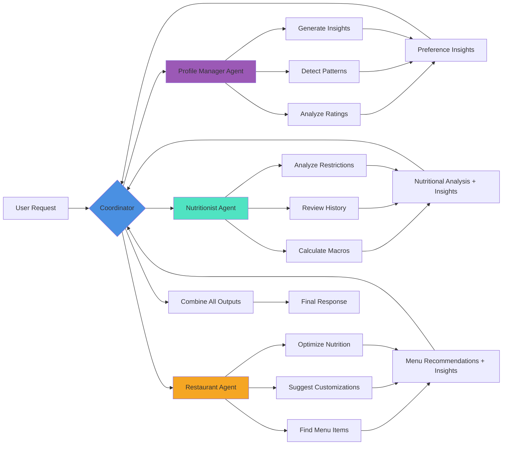
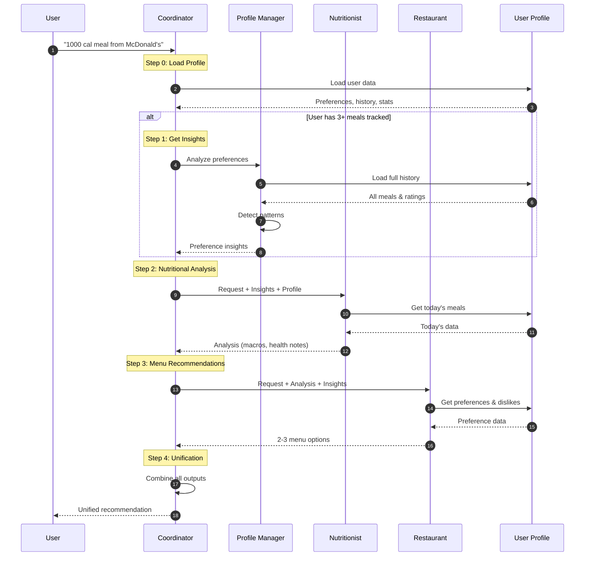
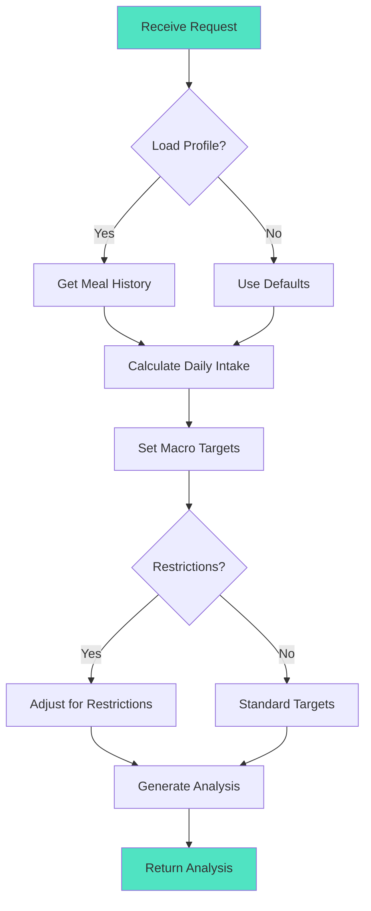
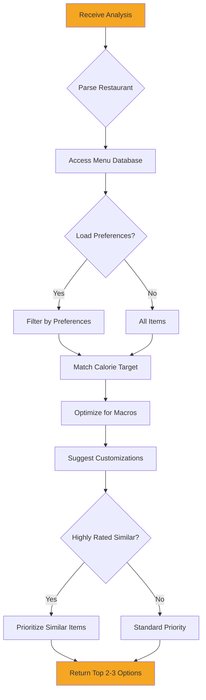
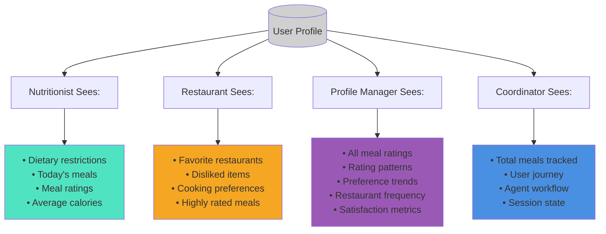

# Agent Workflow & Interactions

## Request Processing Pipeline



## Detailed Sequence Flow



## Agent Decision Making

### Nutritionist Agent Logic



### Restaurant Agent Logic



## Context-Aware Features

### What Each Agent Sees



## Example Workflows

### Workflow 1: Meal Recommendation

**Input:** "I want a 1200 calorie meal from Chick-fil-A. I'm gluten-free."

**Nutritionist Output:**
```
- Target: 1200 cal
- Protein: 60g (high priority)
- Sodium: <800mg
- Must be gluten-free
```

**Restaurant Output:**
```
Option 1: Grilled Nuggets + Side Salad
Option 2: Grilled Chicken Sandwich (no bun)
Option 3: Market Salad + Fruit Cup
```

**Coordinator Output:**
```
Combined, personalized recommendation with:
- Nutritional rationale
- Specific menu items
- Customization tips
- Reference to user history
```

### Workflow 2: Profile Insights

**Input:** "Show my preference insights" (CLI: `python profile_insights.py username`)

**Profile Manager Output:**
```
Detected Preferences:
- Loves Chick-fil-A (5⭐ average)
- Prefers grilled over fried
- Dislikes spicy items

Recommendation Accuracy:
- Average satisfaction: 4.2/5 stars
- Most successful: Grilled options

Suggested Updates:
- Add "grilled" to cooking preferences
- Add "spicy sauces" to dislikes
- Add Chick-fil-A to favorites

Personalized Tips:
- Continue choosing grilled options
- Try similar items at other restaurants
```

